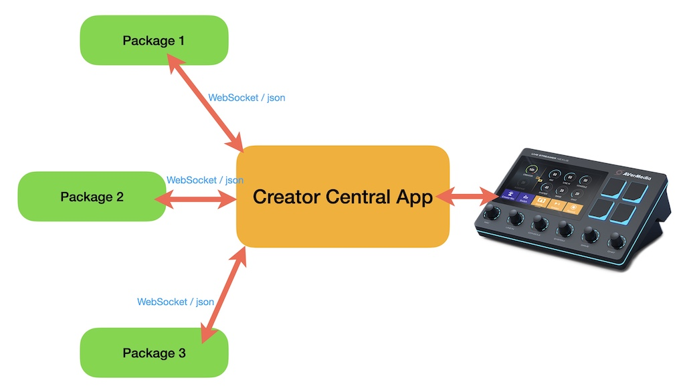
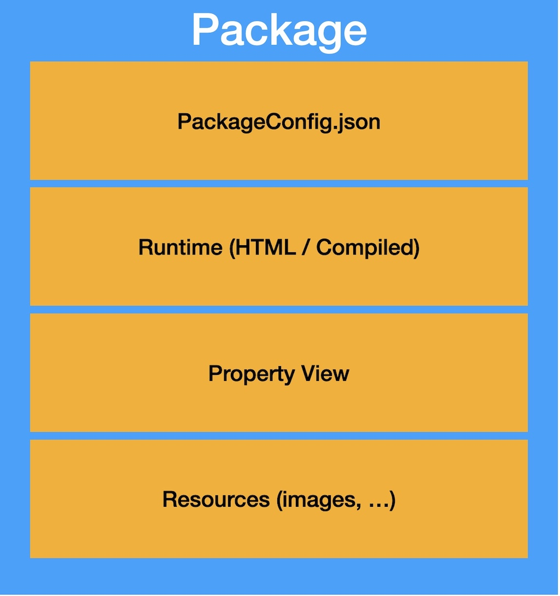

Architecture
===

## Architecture

Creator Central loads all the custom packages when the application starts. WebSocket APIs allow bidirectional communication between the packages and the Creator Central application using JSON.

<br/>
<div align="center">
	
</div>
<br/>

### Package Registration
Creator Central will provide a specific WebSocket port to the Package. A Package must follow the Registration Flow to establish the bidirectional communication between Creator Central and itself.

### Key Events
Only one instance of the Package will be executed by Creator Central. When multiple widgets in the same package are running in Panel, the Package must handle all events by the identifier in them. Those events includes key down/up, widget triggered, etc.

### Cross Platform
Creator Central supports cross-platform packages for Windows and macOS. These packages can be executables written in JavaScript, C++ or other programming languages.

## Package

<br/>
<div align="center">
	
</div>
<br/>

A package is composed of 4 elements:

- PackageConfig.json: describes the package (name, author, icon, etc.) and defines the widgets
- Runtime: the runtime instance executed on startup. It controls the main business logic and updates the display content.
- Property View: user configurations if necessary
- Resources: images, etc.

The PackageConfig.json file has a Runtime member indicating the path to the plugin's executable instance. An HTML file (in case you use JavaScript) or a compiled command-line tool (C++, Objective-C, C#, ...) to run in a separate process.

## Package Unique Identifier
Every Package must have a unique identifier in Creator Central. The unique identifier must be contained only lowercase alphanumeric characters(a-z, 0-9), hyphen(-), and period(.). We strongly suggest to name your identifier in **reverse-DNS** format. For example, a **Hello World** package made by AVerMedia(avermedia.com). We will use **com.avermedia.helloworld** as the unique identifier of this Hello World package.

## Package Instance
Each package is a single instance in Creator Central. All events for widgets in the Panel will be sent to the single instance of the owner Package. Developers should identify the context of widgets to handle all events correctly.

## Widgets

A package can describe multiple widgets in its PackageConfig.json. For example, the System Resources package has three widgets: CPU usage, GPU usage, and Memory Usage. Developers must add these widgets to PackageConfig.json in correct format and Creator Central can read and show them. For more detail information, read [Package Configuration](PackageConfiguration.md). Like the Package, the Widget must also have its own Unique Identifier for the Creator Central application to identify different kinds of widgets in the same package.


## Context
Each widget has their own context and Creator Central will use them to identify the widgets.


## Property View
Developers must follow the [Registration Flow](RegistrationFlow.md) to setup the WebSocket between Property View of Creator Central and the Package. Once the bidirectional communications are established successfully, they can use ```sendToPackage``` and ```sendToPropertyView``` to send data with each other.

When the Property View is displayed, the current settings of the selected widget are passed directly to the Property View in the **payload** parameter. The Property View can use this information to display the current settings in its UI.

You can use the **setWidgetSettings** API to persistently save settings for the widget's instance. The package will also automatically receive a **widgetSettingsDidUpdate** callback with the new settings.

You can use the **setPackageSettings** API to save some data globally for the package (third-party access key, user settings, etc.). When the package uses **setPackageSettings**, the Property View will automatically receive a **packageSettingsDidUpdate** callback with the new global settings. Similarly when the Property View uses this API, the plugin will automatically receive a **packageSettingsDidUpdate** callback.

If you need to pass internal data from the package to the Property View, you can use the **sendToPropertyView** API.

Similarly, if you need to pass internal data from the Property View to a widget within the package, you can use the **sendToWidget** API.``