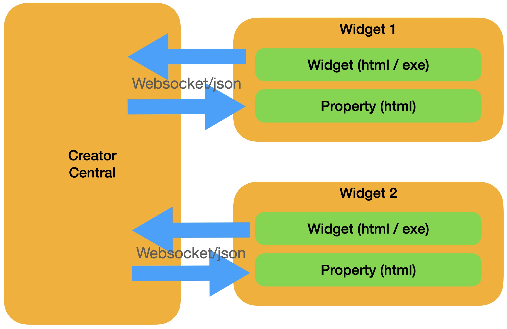
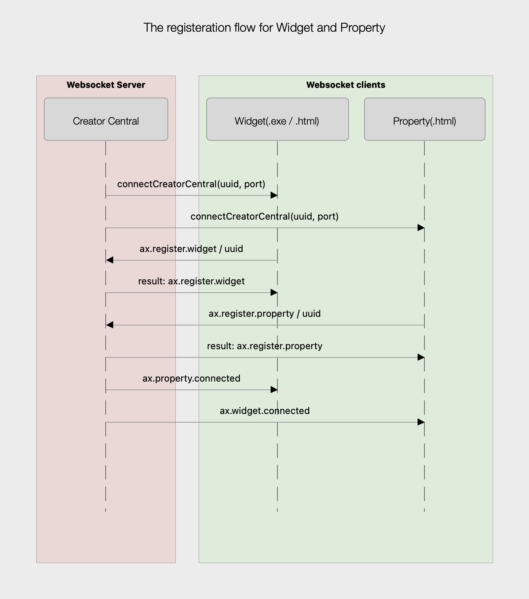
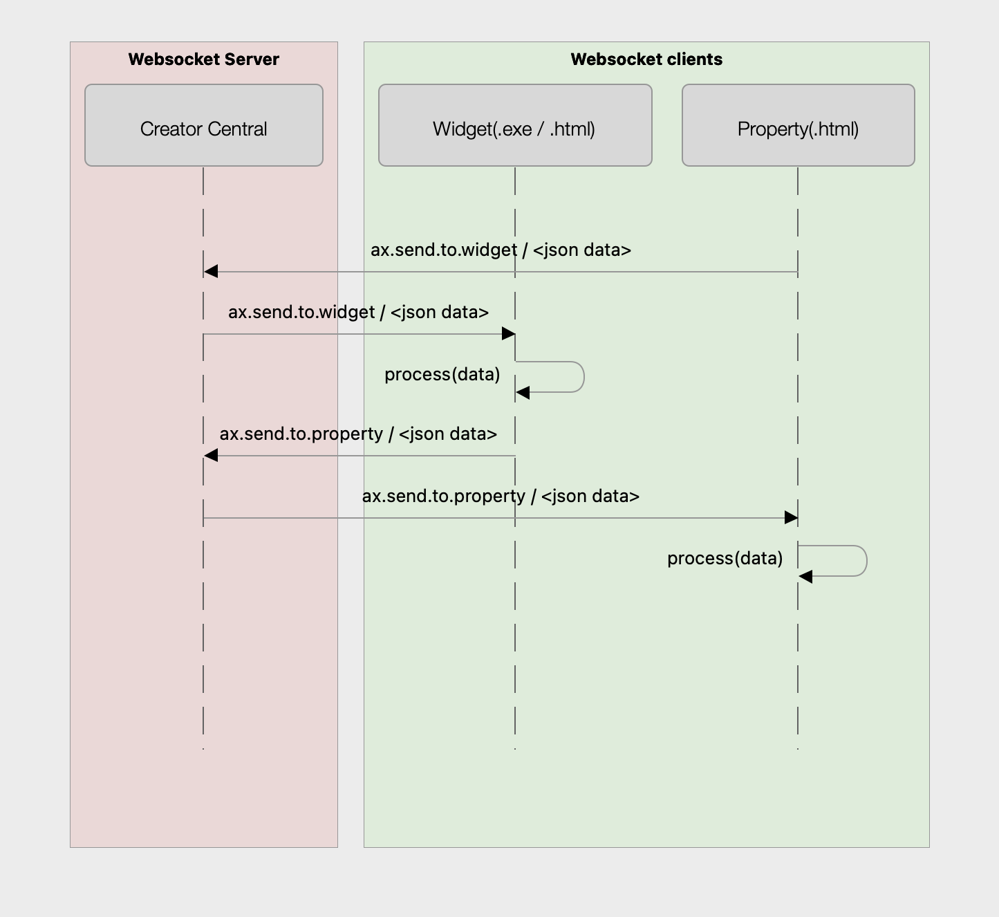
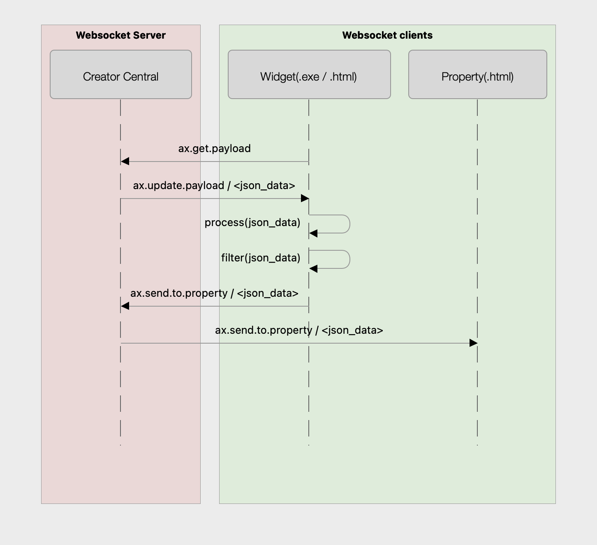
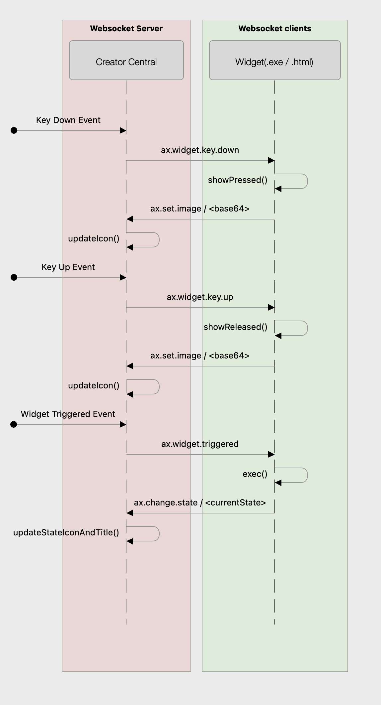

# Contents

[English](#Description)

[中文](#描述)

## Description

The Widget/Property developed by the developer will interact with Creator Central by packaging the jsonrpc command format using Websocket.

</img>

### Registration Process

</img>

### Widget / Property Interaction Example

</img>

### Widget notifies Property to update the latest Payload


</img>

### Widget receives device events from AX


</img>

## package.json

Every package has a [package.json](package.json) file providing the necessary information to help Creator Central to import it correctly.

### Main
| Members | Type | Description |
| - | - | - |
| uuid | Required | The unique identifier of the Package. It must be a uniform type identifier(UTI) that contains only lowercase alphanumeric characters (a-z, 0-9), hyphen (-), and period (.). It should be in reverse-DNS format. For example, if your package is the collection of System Resouce and your domain is avermedia.com, you could give it the string `com.avermedia.systemresources` as your package's unique identifier.  |
| name | Required | The name of the package. This string is visible to the user in the Widget List. |
| version | Required | Package's semantic version (1.0.0.0)  |

## WidgetConfig.json

[WidgetConfig.json](WidgetConfig.json) is used to describe the resources held by Widget and the related information that needs to be displayed in Creator Central

### Main

| Members | Type | Description |
| - | - | - |
| Package | Required | This field will be used to define the Package to which the Widget belongs. |
| Author | Optional | Display author name. |
| Widget Category | Required | Must be named after the reverse domain name, such as com.avermedia.widget.clock...etc. |
| Title | Required | The widget's name, shown in the sidebar. |
| Subtitle | Required | The widget's subheading, displayed in the sidebar. |
| Widget Version | Required | The widget's version, will be used for upgrade verification or compatibility check. |
| Runtime Information | Required | Executable file style and file name, refer to the Runtime Information table below for details. |
| Property Path | Required | Widget's settings page path, Webview will be used to load the file pointed to by this path. |
| Type | Optional | Widget style, currently used to set widget (multi-size) or hotkey (1x1). |
| Width | Required | The width occupied by Widget in the Panel. |
| Height | Required | The height occupied by Widget in the Panel. |
| Icon | Required | The icon displayed by Widget in the sidebar must be 150x108 in size. |
| States | Required | Definition of each state of Widget. |
| Tooltip | Required | Tooltip displayed in the sidebar. |
| Compatible | Required | Used to check the compatibility of Widget and Creator Central, refer to the Compatible Table below for details. |


### Runtime Information
| Members | Type | Description |
| - | - | - |
| mac / win | Required | Defined in Mac / Windows runtime content. |
| Format | Required | 1. Web means to execute the file specified by Target with webview.<br> 2. Bin means that the file specified by Target is an executable file. |
| Target | Required | Executable file name |


###  States

| Members | Type | Description |
| - | - | - |
| Title | Required | The title displayed on View will be updated with the different states specified by Widget. |
| Image | Required | The title displayed on View will be updated with the different states specified by Widget. |


### Compatible

| Members | Type | Description |
| - | - | - |
| SDK Version | Required | The minimum running version of SDK is currently 1.0. |
| App Version | Required | The minimum running version of Creator Central is currently 1.1. |

## Event Received

Widget will receive the following events from the Creator Central main program

### Key Up

User releases and presses AX Panel Widget

``` json 
event = {
    "jsonrpc": "2.0",
    "method": "ax.widget.key.up",
    "params": {
        "id": "<uuid>"
    }
};
```

### Key Down

User presses Widget on the AX Panel

``` json 
event = {
    "jsonrpc": "2.0",
    "method": "ax.widget.key.down",
    "params": {
        "id": "<uuid>"
    }
};
```

### App Triggered 

User executes the current function

``` json 
event = {
    "jsonrpc": "2.0",
    "method": "ax.widget.triggered",
    "params": {
        "id": "<uuid>"
    }
};
```

## Update Payload

After sending the ax.get.payload command, you will receive this notification:

``` json 
event = {
    "jsonrpc": "2.0",
    "method": "ax.update.payload",
    "params": {
        "id": "<uuid>",
        "payload": {
            <payload> # Contains all the upper-level data, Widget's own data is placed in <payload>.payload
        },
        "language": "zh_tw"
    }
};
```

## Set Current Language

The languages scheduled to be supported are as follows:

- "zh_tw"
- "en_us"
- "jp"
- "kr"
- "zh_cn"

``` json
event = {
    "jsonrpc": "2.0",
    "method": "ax.set.current.language",
    "params": {
        "language": "en_us"
    }
};
```

## Event Sent

Widget / Property will send the following events to Creator Central or each other.

### Get Payload 

Widget wants to retrieve the previous settings.<br>


``` json
request = {
    "jsonrpc": "2.0", 
    "method": "ax.get.payload",
    "params": {
        "id": "<uuid>"
    }
};
```


### Set Payload 

Widget sends the payload to be saved to the Creator Central main program for archiving.<br>
This is used to store the respective settings of each Widget, not the system or overall settings.<br>

``` json
request = {
    "jsonrpc": "2.0",
    "method": "ax.set.payload",
    "params": {
        "id": "<uuid>",
        "payload": {
            <payload>
        }
    }
};
```

### Change State

Replace Icon or Title with the specified value of WidgetConfig.json.

``` json
request = {
    "jsonrpc": "2.0",
    "method": "ax.change.state",
    "params": {
        "id": "<uuid>", 
        "payload": {
            "state": 0
        }
    }
};
```

### Set Image 

The image content updated by Widget will be overlaid on the top of Icon.
Only static formats such as PNG/JPG are supported at the moment.

``` json
request = {
    "jsonrpc": "2.0",
    "method": "ax.set.image",
    "params": {
        "id": "<uuid>", 
        "payload": {
            "image": <base64>
        }
    }
};
```

### Send To Widget

Property notifies the Widget of the user's operation or other related information.

``` json
request = {
    "jsonrpc": "2.0",
    "method": "ax.send.to.widget", 
    "params": {
        "id": "<uuid>",
        "payload": {
            <payload>
        }
    }
};
```

### Send to Property

Widget notifies Property related information.

``` json
request = {
    "jsonrpc": "2.0",
    "method": "ax.send.to.property",
    "params": {
        "id": "<uuid>", 
        "payload": {
            <payload>
        }
    }
};
```

## Register Event

### Reigser Widget / Property

Both Widget and Property must register their own <uuid> so that Creator Central can correctly establish a communication channel with them.

``` json
request = {
    "jsonrpc": "2.0",
    "method": "ax.register.widget",
    "params": {
        "id": "<uuid>"
    },
    "id": 0 # must be 0
};

result = {
    "jsonrpc": "2.0",
    "result": "ax.register.widget",
    "id": 0
};

```

``` json
request = {
    "jsonrpc": "2.0",
    "method": "ax.register.property",
    "params": {
        "id": "<uuid>"
    },
    "id": 0 # must be 0
};

result = {
    "jsonrpc": "2.0",
    "result": "ax.register.property",
    "id": 0
};

```

### Widget / Property Connected

After the matching Widget/Property is online, Creator Central will notify Widget/Property that its matching Widget/Property is online. 

``` json
notification = {
    "jsonrpc": "2.0",
    "method": "ax.widget.connected",
    "params": {
        "id": "<uuid>"
    },
    "id": 0 # must be 0
};
```

``` json
notification = {
    "jsonrpc": "2.0",
    "method": "ax.property.connected",
    "params": {
        "id": "<uuid>"
    },
    "id": 0 # must be 0
};
```


## Registration Flow

Widget must use the websocket and uuid specified by Creator Central to correctly establish websocket connection.

1. For exe type Widget
The main argv will receive two pieces of information, uuid and port, and the Widget must register with Creator Central with these two pieces of information.

2. For web type Widget
Js must have connectCreatorCentral function to accept uuid and port information.


## Property Page

Widget can provide Property page to interact with users or allow users to update settings.


## Example code


| Example | Type | Path |
| - | - | - |
| clock | web | [Widget Javascript Sample](https://github.com/AVerMedia-Technologies-Inc/WidgetJSSample) |
| clock | bin/cpp | [Widget CPP Sample](https://github.com/AVerMedia-Technologies-Inc/WidgetCPPSample) |
| clock | bin/C# | [Widget CShape Sample](https://github.com/AVerMedia-Technologies-Inc/WidgetCShapeSample) |
| clock | bin/Swift | [Widget Swift Sample](https://github.com/AVerMedia-Technologies-Inc/WidgetSwiftSample) |

## Default installation path
Widgets must be placed in a specific path in order to be correctly loaded by Creator Central.

### macOS
The Widget directory needs to be placed under "/Users/\<UserName>/Applications Support/AVerMedia Creator Central/widgets/\<PackageName>/".

### Windows
The Widget directory needs to be placed under "C:\\Users\\＜YourName＞\\AppData\\Roaming\\AVerMedia Creator Central\\widgets\\\<PackageName>\\".

## Compatibility

### Creator Central 
Requires Creator Central v1.1.0.38 or later.

---

## 描述
Widget / Property透過jsonrpc的指令與Creator Central進行互動


</img>

### 註冊流程

</img>

### Widget / Property 互動範例

</img>

### Widget 通知 Property 更新最新Payload

</img>

### Widget收到來自AX的設備事件

</img>

## package.json

每個package都有一個[package.json](package.json)用來提供必要資訊，讓Creator Central可以正確地匯入它.

### Main

| Members | Type | Description |
| - | - | - |
| uuid | Required | 這是Package的唯一識別碼. 必須是以反域名的樣式包含了小寫的英文字母，數字，連字號跟句數. 舉例來說，你的Package是系統資源的一組操作集合，並擁有一組域名avermedia.com，那麼你將可以使用com.avermedia.systemresources做為你的Package的唯一識別碼. |
| name | Required | 這是Package的名字，會顯示在側邊欄的Widget List上. |
| version | Required | Package的版號 (1.0.0.0) |

## WidgetConfig.json
[WidgetConfig.json](WidgetConfig.json) 用來描述Widget所持有的資源以及在Creator Central所需顯示的相關資訊

### Main
| Members | Type | Description |
| - | - | - |
| Package | Required | 這欄位會用來定義Widget所屬Package.|
| Author | Optional | 顯示作者名稱|
| Widget Category | Required | 必須以反向域名命名，比如com.avermedia.widget.clock ...etc |
| Title | Required | Widget的名稱，顯示於側邊欄 |
| Subtitle | Required | Widget的副標題，顯示於側邊欄 |
| Widget Version | Required | Widget的版本，將會用於升級驗證或相容性檢查 |
| Runtime Information | Required | 執行檔樣式與檔名，細節請參閱下方Runtime Information表格 |
| Property Path | Required | Widget的設定頁路徑，將會用webview載入此路徑指向的檔案 |
| Type | Optional | Widget的樣式，目前用來設定是widget (多尺寸)或hotkey(1x1) |
| Width | Required | Widget在Panel佔用的寬 |
| Height | Required | Widget在Panel佔用的高 |
| Icon | Required | Widget在側邊欄所顯示的圖示，尺寸需為150x108 |
| States | Required | Widget的各項狀態定義 |
| Tooltip | Required | 在側邊欄顯示的Tooltip |
| Compatible | Required | 用於檢查Widget與Creator Central的相容性，細節請參閱下方Compatible表格 |


### Runtime Information
| Members | Type | Description |
| - | - | - |
| mac / win | Required | 定義在mac / windows執行期內容 |
| Format | Required | 1. web表示以webview執行Target指定的檔案<br>2. bin表示Target指定的檔案為執行檔 |
| Target | Required | 執行檔名稱 |


###  States

| Members | Type | Description |
| - | - | - |
| Title | Required | 顯示於View上的標題，會隨著Widget指定的不同狀態而更新 |
| Image | Required | 顯示於View上的圖示，會隨著Widget指定的不同狀態而更新 |


### Compatible

| Members | Type | Description |
| - | - | - |
| SDK Version | Required | SDK最低運行版本，目前統一 "1.0" |
| App Version | Required | Creator Central最低運行版本，目前統一 "1.1" |

## Event Received

Widget將會收到Creator Central主程式發送以下之事件

### Key Up

使用者放開按壓 AX Panel Widget

``` json 
event = {
    "jsonrpc": "2.0",
    "method": "ax.widget.key.up",
    "params": {
        "id": "<uuid>"
    }
};
```

### Key Down

使用者按下AX Panel上的Widget

``` json 
event = {
    "jsonrpc": "2.0",
    "method": "ax.widget.key.down",
    "params": {
        "id": "<uuid>"
    }
};
```

### App Triggered 

使用者執行現在的功能

``` json 
event = {
    "jsonrpc": "2.0",
    "method": "ax.widget.triggered",
    "params": {
        "id": "<uuid>"
    }
};
```

## Update Payload

發送ax.get.payload指令之後，將會收到此通知

``` json 
event = {
    "jsonrpc": "2.0",
    "method": "ax.update.payload",
    "params": {
        "id": "<uuid>",
        "payload": {
            <payload> # 包含了上層所有資料，Widget自己的資料放 <payload>.payload裡
        },
        "language": "zh_tw"
    }
};
```

## Set Current Language

預定支援的語言如下表：

- "zh_tw"
- "en_us"
- "jp"
- "kr"
- "zh_cn"

``` json
event = {
    "jsonrpc": "2.0",
    "method": "ax.set.current.language",
    "params": {
        "language": "en_us"
    }
};
```

## Event Sent

Widget / Property會發送以下事件給Creator Central或彼此

### Get Payload 

Widget 想取回之前的設定值<br>


``` json
request = {
    "jsonrpc": "2.0", 
    "method": "ax.get.payload",
    "params": {
        "id": "<uuid>"
    }
};
```


### Set Payload 

Widget 把要保存的payload發給Creator Central主程式做存檔<br>
這是用來儲存每個Widget各自的設定值，而非系統或全體設定值<br>

``` json
request = {
    "jsonrpc": "2.0",
    "method": "ax.set.payload",
    "params": {
        "id": "<uuid>",
        "payload": {
            <payload>
        }
    }
};
```

### Change State

將Icon或Title更換為WidgetConfig.json的指定值

``` json
request = {
    "jsonrpc": "2.0",
    "method": "ax.change.state",
    "params": {
        "id": "<uuid>", 
        "payload": {
            "state": 0
        }
    }
};
```

### Set Image 

Widget自行更新的影像內容，將會覆蓋於Icon最上方。
目前只支援 PNG/JPG 等靜態格式。

``` json
request = {
    "jsonrpc": "2.0",
    "method": "ax.set.image",
    "params": {
        "id": "<uuid>", 
        "payload": {
            "image": <base64>
        }
    }
};
```

### Send To Widget

Property將使用者的操作或其他相關資料通知Widget

``` json
request = {
    "jsonrpc": "2.0",
    "method": "ax.send.to.widget", 
    "params": {
        "id": "<uuid>",
        "payload": {
            <payload>
        }
    }
};
```

### Send to Property

Widget通知Property相關資訊

``` json
request = {
    "jsonrpc": "2.0",
    "method": "ax.send.to.property",
    "params": {
        "id": "<uuid>", 
        "payload": {
            <payload>
        }
    }
};
```

## Register Event

### Reigser Widget / Property

Widget與Property都必須註冊自己的 <uuid>，Creator Central才能正確建立與其的通訊管道

``` json
request = {
    "jsonrpc": "2.0",
    "method": "ax.register.widget",
    "params": {
        "id": "<uuid>"
    },
    "id": 0 # must be 0
};

result = {
    "jsonrpc": "2.0",
    "result": "ax.register.widget",
    "id": 0
};

```

``` json
request = {
    "jsonrpc": "2.0",
    "method": "ax.register.property",
    "params": {
        "id": "<uuid>"
    },
    "id": 0 # must be 0
};

result = {
    "jsonrpc": "2.0",
    "result": "ax.register.property",
    "id": 0
};

```

### Widget / Property Connected

在配套的 Widget / Property 都上線後，Creator Central會通知 Widget / Property，其配套的Widget/Property已上線 

``` json
notification = {
    "jsonrpc": "2.0",
    "method": "ax.widget.connected",
    "params": {
        "id": "<uuid>"
    },
    "id": 0 # must be 0
};
```

``` json
notification = {
    "jsonrpc": "2.0",
    "method": "ax.property.connected",
    "params": {
        "id": "<uuid>"
    },
    "id": 0 # must be 0
};
```


## Registration Flow

Widget須透過Creator Central指定的websocket與uuid，來正確建立websocket連線

1. For exe類型Widget
main的argv將收到 uuid , port兩項資訊，Widget須以此兩項資訊向Creator Central進行註冊動作

2. web類型Widget
js須有 connectCreatorCentral 函式用來接受uuid , port兩項資訊

## Property 頁面

Widget可提供Property頁面與使用者互動或讓使用者更新設定值


## Example code


| Example | Type | Path |
| - | - | - |
| clock | web | [Widget Javascript Sample](https://github.com/AVerMedia-Technologies-Inc/WidgetJSSample) |
| clock | bin/cpp | [Widget CPP Sample](https://github.com/AVerMedia-Technologies-Inc/WidgetCPPSample) |
| clock | bin/C# | [Widget CShape Sample](https://github.com/AVerMedia-Technologies-Inc/WidgetCShapeSample) |
| clock | bin/Swift | [Widget Swift Sample](https://github.com/AVerMedia-Technologies-Inc/WidgetSwiftSample) |

## 預設安裝路徑

Widget必須被置放在特定路徑下，才能被Creator Central正確讀取並載入。

### macOS

Widget 目錄需放置到"/Users/\<UserName>/Applications Support/AVerMedia Creator Central/widgets/\<PackageName>/"下

### Windows

Widget目錄需放置到"C:\\Users\\＜YourName＞\\AppData\\Roaming\\AVerMedia Creator Central\\widgets\\\<PackageName>\\"下

## 相容性

### Creator Central 
需要 Creator Central v1.1.0.38 或之後的版本.
