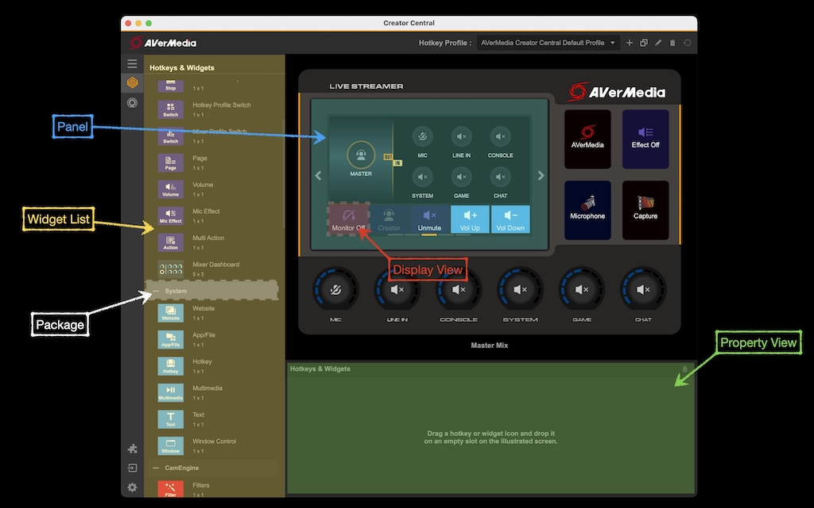

# Terminology
 

	

 

## Widget List

The Widget List is on left side of Creator Central. It shows all available widgets by packages.
User can drag the widgets to Panel and start using them.

## Panel

The Panel is the main user interface of Creator Central. It shows all running widgets on the target device.
Each widget has their own Display View. You can arrange the size and position of each widget here.
Everything shows in the main panel will be identical to the device.

## Display View

A display view is a widget's user interface. A widget should be able to control their own interface in the display view.
The size of the display view will be defined by Creator Central.
Widget can show values, icons or pictures in the Display View.

For example, a light switch widget has 2 state: ON and OFF.
The light switch widget can set different icons in the Display View to indicate current light state.

Take CPU usage widget as another example, it will show cpu usage value with color in the Display View.
A user can identify the cpu loading by the value and color of the widget's Display View.

## Property View

Property View is a property configuration panel. When user selected one widget in Panel, it will show its own properties here.
A widget can use these properties to change its icon, title or other configurations.

## Package

Your Package is defined in [PackageConfig.json](PackageConfiguration.md) file.
All widgets with the same package will be listed together in Widget List.